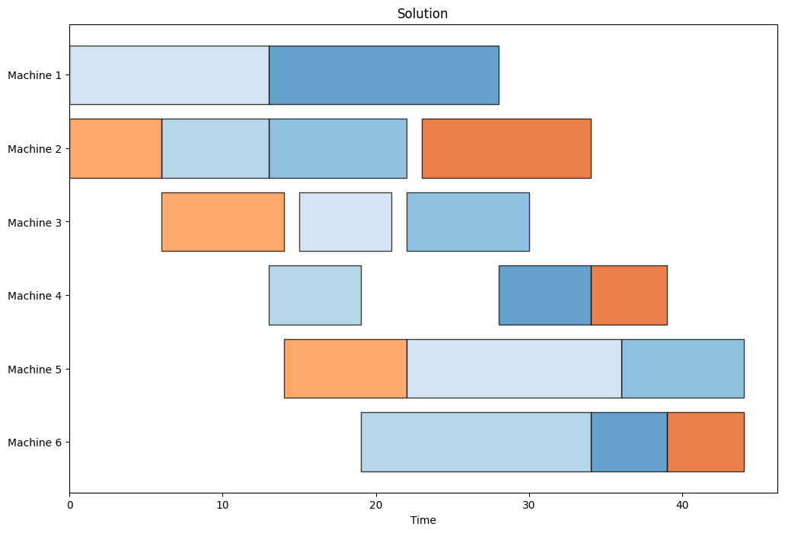

Introduction to scheduling
==========================

.. What is scheduling?

Scheduling deals with allocating tasks to resources over time. The goal is to optimize some objective, often the makespan, while completing all tasks in a timely manner and respecting all constraints. Scheduling applications are numerous: car manufacturers, chemical plants, project managers all deal with scheduling on a daily basis.

.. _gantt-chart:

   Figure 1: A Gantt chart that visualizes the solution to a scheduling problem.

.. Scheduling concepts

Most scheduling problems include three key concepts: jobs, tasks, and resources. Jobs represent collections of tasks and are used to measure performance. Tasks are the smallest units of work that need to be performed. Resources include all materials and personnel available for completing the tasks. In addition to these key concepts, specific scheduling applications might have other requirements such as different processing modes, task precedence constraints, and setup times.

A solution to a scheduling problem includes the specific task-to-resource assignment and the determination of all task start and end times. Such a solution can be visualized using a Gantt chart (see figure above).

.. note::

   In scheduling, it is assumed that all tasks are *known*, whereas lot-sizing or batching problems also deal with determining *which tasks* to produce. PyJobShop only deals with scheduling problems.

.. Solving scheduling problems

Optimizing scheduling problems has been keeping researchers very interested because of the potential time savings,
However, since most scheduling problems are classified as NP-hard, obtaining the optimal solution can be extremely difficult.
There is a variety of proposed methods to solve scheduling scheduling methods, such as heuristics, metaheuristics, and exact algorithms, which include local search, genetic algorithms, and branch-and-cut algorithms.

.. note::

   PyJobShop uses constraint programming to solve scheduling problems. Learn more about constraint programming on the :doc:`introduction to CP <./intro_to_cp>` page.
